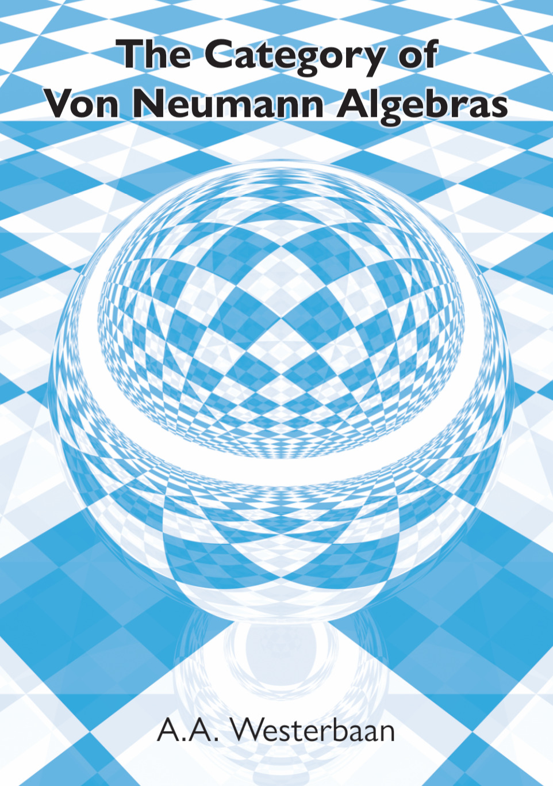
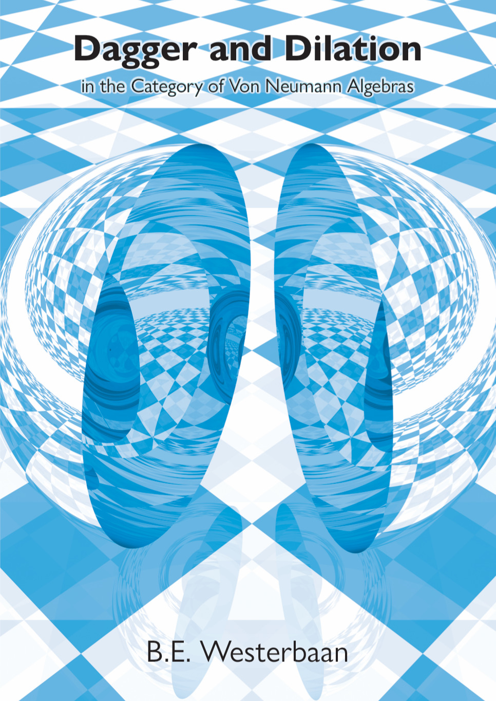

Theses of Abraham and Bas Westerbaan
====================================

 

Generating PDFs
---------------
The theses can be typeset by running `make`.  On some platforms the generated PDFs will lack an index due to `xindy` not being available.  Such issues can be avoided by running `make` inside the `texlive` container using: `docker run --rm -v .:/workdir -it texlive/texlive make`.

See also
--------

* [Path tracer for the Cover](https://github.com/westerbaan/ndpt)
* [Homepage of the defences](https://westerbaan.name/promotie)
