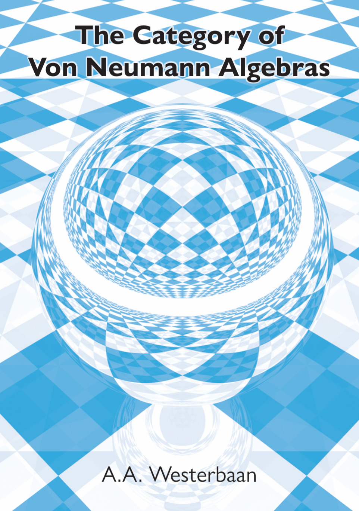
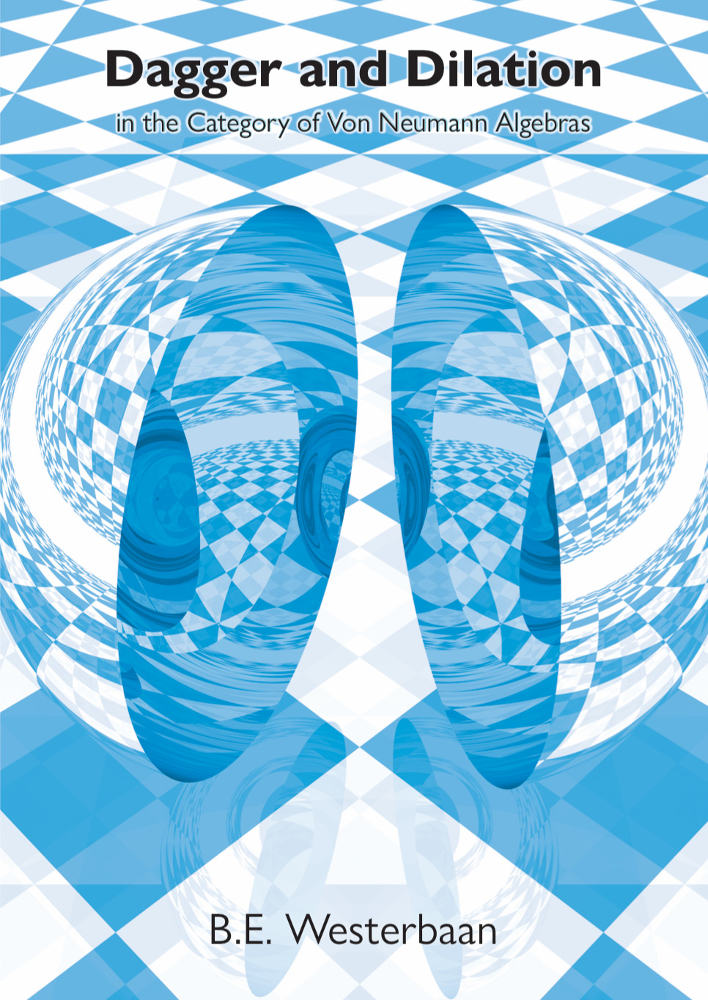

Theses of Abraham and Bas Westerbaan
====================================

 

Generating PDFs
---------------
The theses can be typeset by running `make`.  The index needs `xindy`, which TeX Live does not ship for every platform.  Where `xindy` is missing from the `PATH`, `make` runs it in a small container instead: build that image once with `make xindy-image`, which needs a `docker` command.  Alternatively, where TeX Live does ship `xindy`, the whole build runs in the `texlive` container: `docker run --rm -v .:/workdir -it texlive/texlive make`.

The two theses cross-reference each other, so `b.pdf` has to be typeset before the references of `a.pdf` into thesis B can resolve.  `make` builds them in the opposite order, so remove `a.pdf` and run `make` once more.

See also
--------

* [Path tracer for the Cover](https://github.com/westerbaan/ndpt)
* [Homepage of the defences](https://westerbaan.name/promotie)
